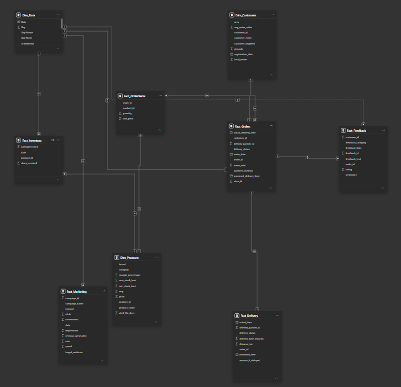
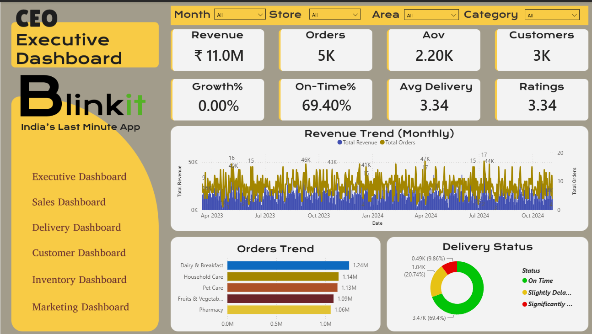
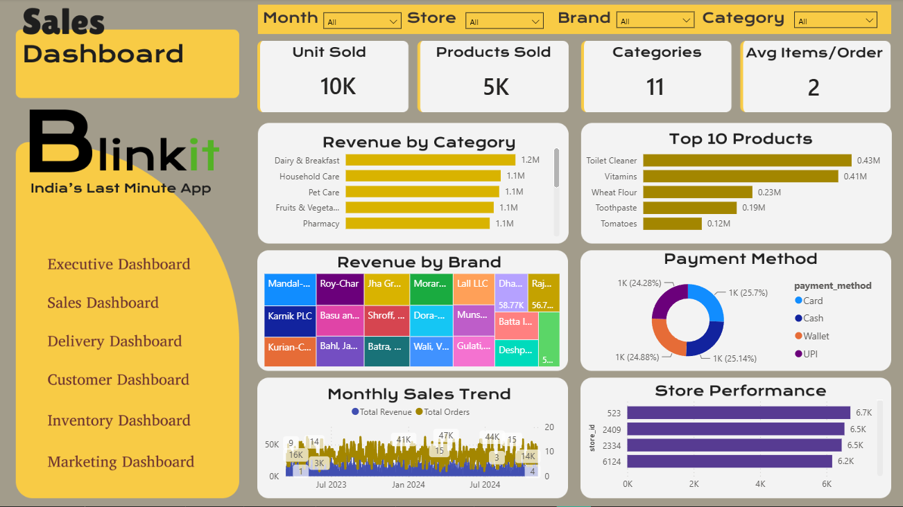
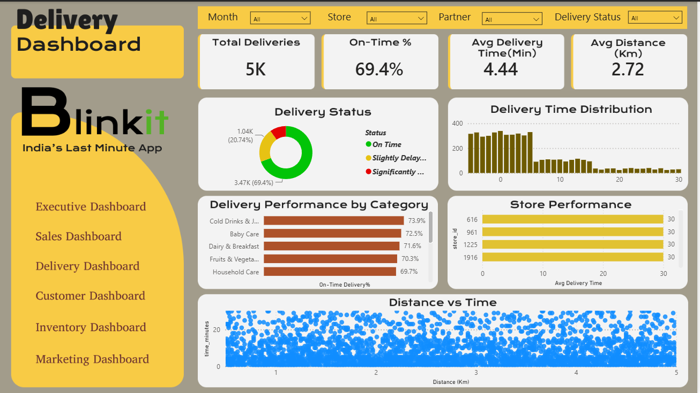
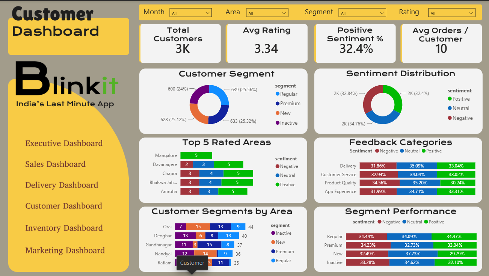
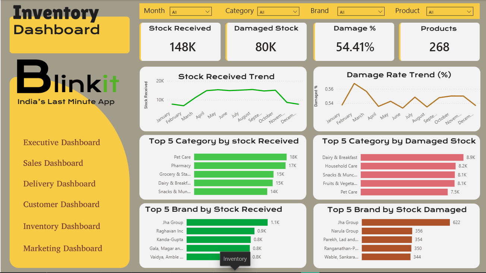
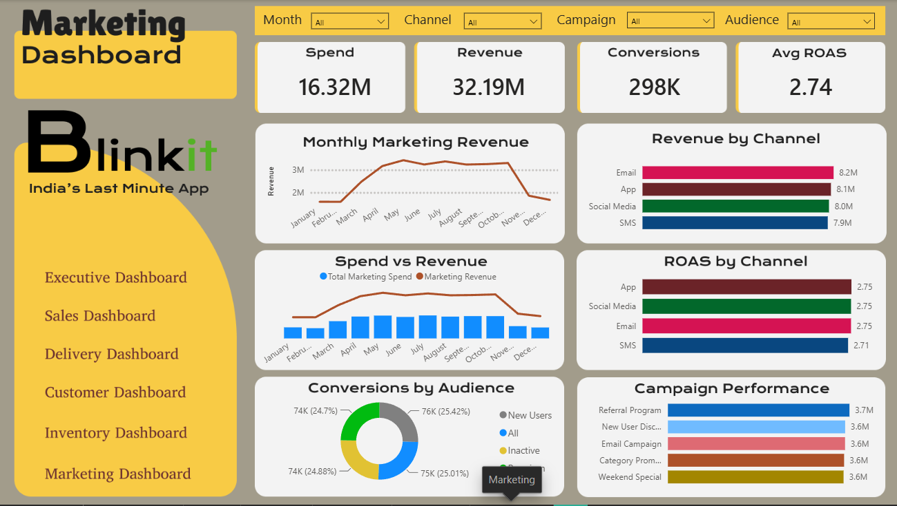

# Blinkit Business Analytics Dashboard | End-to-End Power BI Project

<p align="center">
  
</p>

<p align="center">


</p>

---

# Project Overview

This project is an **end-to-end Business Intelligence solution** developed using **Power BI** to analyze Blinkit's business performance across multiple business functions.

The objective of this project is to convert raw operational data into actionable business insights through interactive dashboards that assist management in monitoring KPIs, identifying trends, and making data-driven decisions.

The project follows a complete analytics workflow similar to a real-world BI project—from understanding business requirements to data modeling, KPI creation, dashboard development, and business storytelling.

---

# Business Problem

Blinkit operates in a highly competitive quick-commerce industry where thousands of transactions, deliveries, inventory updates, customer interactions, and marketing campaigns occur daily.

Business stakeholders require a centralized analytics solution to answer questions such as:

- How is the business performing overall?
- Which product categories generate the highest revenue?
- Which stores perform the best?
- Are deliveries meeting service-level expectations?
- How satisfied are customers?
- Which products require inventory attention?
- Which marketing campaigns generate the best return?

This dashboard was built to answer these questions through interactive visualizations.

---

# Project Objectives

- Build an interactive Executive Dashboard for management.
- Analyze sales performance across products, brands, and categories.
- Evaluate delivery efficiency and operational performance.
- Understand customer satisfaction using ratings and sentiment analysis.
- Monitor inventory performance and stock health.
- Analyze marketing campaign effectiveness.
- Design dashboards that tell meaningful business stories rather than simply displaying data.

---

# Tools & Technologies

| Tool | Purpose |
|------|---------|
| Microsoft Excel | Data Source |
| Power Query | Data Cleaning & Transformation |
| Power BI | Dashboard Development |
| DAX | KPI & Measure Development |
| Star Schema | Data Modeling |

---

# Dataset Information

The project consists of **9 Excel datasets** representing different departments of the business.

| Dataset | Description |
|----------|-------------|
| blinkit_orders | Customer Orders |
| blinkit_order_items | Products sold in each order |
| blinkit_products | Product Master |
| blinkit_customers | Customer Details |
| blinkit_customer_feedback | Ratings & Customer Feedback |
| blinkit_delivery_performance | Delivery Operations |
| blinkit_inventory | Daily Inventory |
| blinkit_inventoryNew | Additional Inventory Records |
| blinkit_marketing_performance | Marketing Campaign Performance |

### Dataset Summary

- **9 Excel Files**
- **115,000+ Records**
- **6 Fact Tables**
- **3 Dimension Tables**
- **40+ DAX Measures**
- **6 Interactive Dashboards**

---

# Data Modeling

A **Star Schema** was implemented to improve report performance, simplify relationships, and enable efficient DAX calculations.

### Fact Tables

- Fact Orders
- Fact Order Items
- Fact Delivery
- Fact Inventory
- Fact Feedback
- Fact Marketing

### Dimension Tables

- Dim Date
- Dim Customers
- Dim Products

---

## Data Model

<p align="center">

</p>

---

# Dashboard Pages

---

# 1️ Executive Dashboard

### Purpose

Provides a high-level overview of overall business performance for executives.

### KPIs

- Total Revenue
- Total Orders
- Average Order Value
- Total Customers
- Revenue Growth
- On-Time Delivery %
- Average Delivery Time
- Average Customer Rating

### Visuals

- Revenue Trend
- Delivery Status
- Order Trend
- Category Performance

<p align="center">

</p>

---

# 2️ Sales Dashboard

### Purpose

Analyzes sales performance across products, brands, stores, and categories.

### KPIs

- Units Sold
- Products Sold
- Categories
- Average Items per Order

### Visuals

- Revenue by Category
- Top Products
- Revenue by Brand
- Monthly Sales Trend
- Payment Method Distribution
- Store Performance

<p align="center">

</p>

---

# 3️ Delivery Dashboard

### Purpose

Monitors delivery efficiency and operational performance.

### KPIs

- Total Deliveries
- On-Time Delivery %
- Average Delivery Time
- Average Delivery Distance

### Visuals

- Delivery Status
- Delivery Time Distribution
- Delivery Performance by Category
- Store Performance
- Distance vs Delivery Time

<p align="center">

</p>

---

# 4️ Customer Dashboard

### Purpose

Analyzes customer behavior and satisfaction.

### KPIs

- Total Customers
- Average Rating
- Positive Sentiment %
- Average Orders per Customer

### Visuals

- Customer Segments
- Sentiment Distribution
- Rating by Area
- Feedback Categories
- Customer Segment Analysis

<p align="center">

</p>

---

# 5️ Inventory Dashboard

### Purpose

Monitors inventory health and stock movement.

### KPIs

- Total Stock Received
- Damaged Stock
- Inventory Health
- Low Stock Products

### Visuals

- Inventory by Category
- Damaged Stock Analysis
- Stock Trend
- Product Inventory Performance
- Category Inventory Analysis

<p align="center">

</p>

---

# 6️ Marketing Dashboard

### Purpose

Measures marketing campaign effectiveness.

### KPIs

- Campaign Revenue
- ROAS
- Conversion Rate
- Marketing Spend

### Visuals

- Campaign Performance
- Channel Performance
- Revenue Generated
- Monthly Marketing Trend
- ROI Analysis

<p align="center">

</p>

---

#  Key Business Insights

## Executive

- Business maintained consistent revenue throughout the analysis period.
- Approximately **69%** of deliveries were completed on time.
- Customer satisfaction remained above average.

## Sales

- A small number of product categories generated a significant share of total revenue.
- Revenue varied across brands and stores.
- Payment methods were evenly distributed among customers.

## Delivery

- Delivery time increased with travel distance.
- Delivery performance differed across product categories.
- Most deliveries were completed within acceptable service levels.

## Customer

- Customer segments were evenly distributed.
- Delivery and Customer Service generated the highest number of feedback cases.
- Customer ratings varied across different geographical areas.

## Inventory

- Inventory monitoring helped identify products requiring stock replenishment.
- Damaged stock tracking highlighted operational improvement opportunities.

## Marketing

- Campaign effectiveness varied significantly across channels.
- ROAS analysis helped identify high-performing campaigns.

---

# Skills Demonstrated

### Business Intelligence

- Dashboard Design
- KPI Development
- Business Storytelling
- Executive Reporting

### Data Analytics

- Data Cleaning
- Data Transformation
- Data Validation
- Exploratory Data Analysis

### Power BI

- Power Query
- DAX
- Data Modeling
- Star Schema
- Interactive Reports
- Drill-through
- Slicers
- Bookmarks

### Business Analysis

- Sales Analysis
- Customer Analytics
- Delivery Analytics
- Inventory Analytics
- Marketing Analytics

---

# Repository Structure

```
Blinkit-Business-Analytics/
│
├── Blinkit_Business_Analytics.pbix
│
├── Dataset/
│   ├── blinkit_orders.xlsx
│   ├── blinkit_order_items.xlsx
│   ├── blinkit_products.xlsx
│   ├── blinkit_customers.xlsx
│   ├── blinkit_customer_feedback.xlsx
│   ├── blinkit_delivery_performance.xlsx
│   ├── blinkit_inventory.xlsx
│   ├── blinkit_inventoryNew.xlsx
│   └── blinkit_marketing_performance.xlsx
│
|Bg_Images/
│   ├── Executive_Dashboar.png
│   ├── Sales_Dashboar.png
│   ├── Delivery_Dashboar.png
│   ├── Customer_Dashboar.png
│   ├── Inventory_Dashboar.png  
│   └── Marketing_Dashboar.png

├── Images/
│   ├── Dashboard_Overview.png
│   ├── Executive_Dashboard.png
│   ├── Sales_Dashboard.png
│   ├── Delivery_Dashboard.png
│   ├── Customer_Dashboard.png
│   ├── Inventory_Dashboard.png
│   ├── Marketing_Dashboard.png
│   └── Data_Model.png
│
├── Documentation/
│   ├── Business_Insights.pdf
│   ├── DAX_Measures.md
│   ├── Data_Dictionary.md
│   └── Project_Architecture.pdf
│
└── README.md
```

---

# Contact

**Sachin Saibo**

Aspiring Data Analyst

- LinkedIn: *(www.linkedin.com/in/sachin-saibo-0b463a255)*
- Email: *(ssaibo08@gmail.com)*

---

# Support

If you found this project helpful or interesting, please consider giving it a ⭐ on GitHub.

Feedback and suggestions are always welcome!
